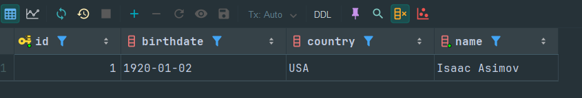
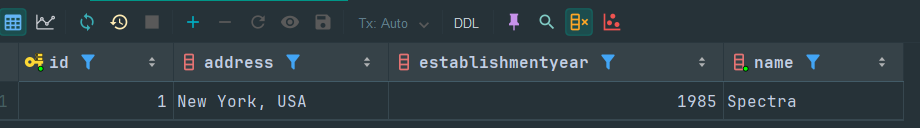
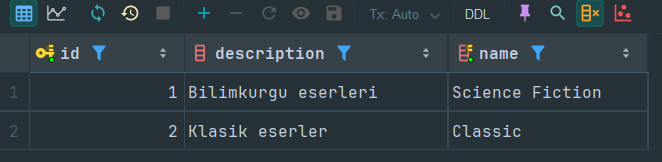
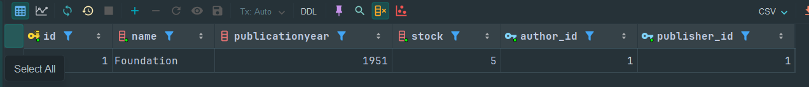
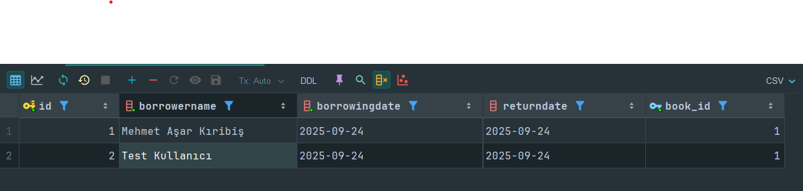

# 📚 Library Management (JPA + Hibernate + PostgreSQL)

Bu proje, bir kütüphane yönetim sisteminin temel entity’lerini ve aralarındaki ilişkileri **JPA/Hibernate** kullanarak modelleyen bir Maven tabanlı Java uygulamasıdır.

## 🚀 Teknolojiler
- Java 21
- Maven
- Jakarta Persistence (JPA)
- Hibernate ORM
- PostgreSQL

## 🗄️ Varlıklar & İlişkiler
- **Author (1) → (n) Book**
- **Publisher (1) → (n) Book**
- **Book (n) ↔ (n) Category** (Join table: `book_categories`)
- **Book (1) → (n) BookBorrowing**

### Fetch & Cascade Kuralları
- `@ManyToOne` ilişkileri: **LAZY**
- `Book.borrowings`: `cascade = ALL`, `orphanRemoval = true`
- `Book.categories`: `@ManyToMany(fetch = LAZY)` + `@JoinTable`

## ⚙️ Kurulum
1. PostgreSQL’de `librarydb` veritabanını oluştur:
   ```sql
   CREATE DATABASE librarydb;
   ```
2. `src/main/resources/META-INF/persistence.xml` içindeki JDBC bilgilerini sistemine göre düzenle.
3. IntelliJ IDEA’da `App.main()` çalıştır.
4. Hibernate otomatik olarak tabloları oluşturur (`hibernate.hbm2ddl.auto=update`).

## 📊 Veritabanı Tabloları (Ekran Görüntüleri)

### Authors


### Publishers


### Categories


### Books


### Book Borrowings


### Book Categories (Join Table)


---

## ✨ Özellikler
- Kitap ekleme, listeleme, kategorilendirme
- Yazar ve yayınevi ilişkilendirme
- Kitap ödünç alma ve iade işlemleri
- PostgreSQL üzerinde otomatik şema yönetimi (Hibernate ORM)

---

🔗 **Not:** Görseller `docs/screens/` klasöründe tutulur. GitHub’a push ettiğinde README içindeki tüm tablolar görsel olarak görüntülenecektir.
